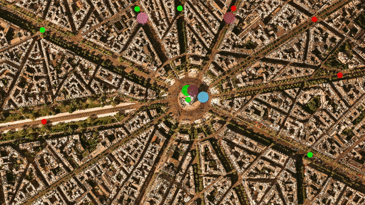

# Concurrent Traffic Simulation

This is an implementation of a Concurrent Traffic Simulation in C++. A thread-safe communication protocol between vehicles and intersections to complete the simulation was built using concepts of Concurrency. Each intersection in the map is equipped with a traffic light. Traffic lights can either be red or green at a given time.

## Dependencies for Running Locally
* cmake >= 2.8
* make >= 4.1
* OpenCV >= 4.1
* gcc/g++ >= 5.4
  
## Basic Build Instructions

1. Clone this repo.
2. Make a build directory in the top level directory: `mkdir build && cd build`
3. Compile: `cmake .. && make`
4. Run it: `./traffic_simulation`.